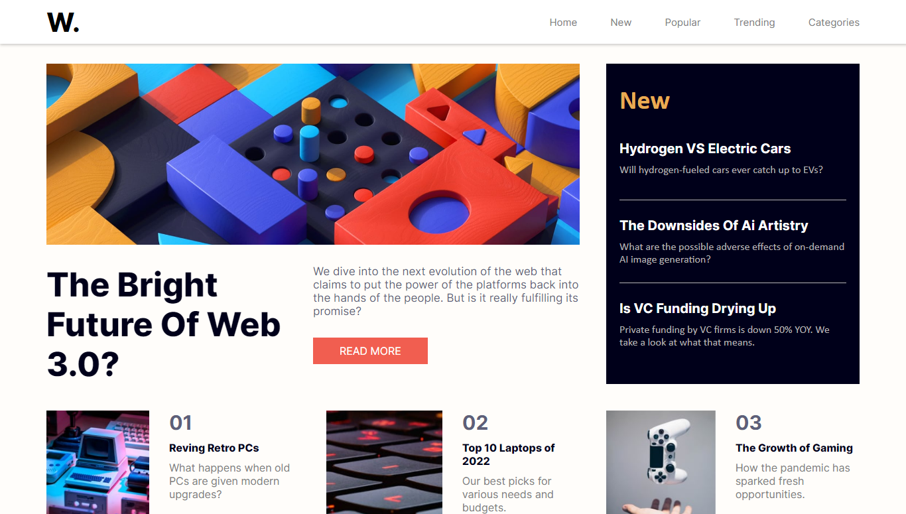

# Frontend Mentor - News homepage solution

This is a solution to the [News homepage challenge on Frontend Mentor](https://www.frontendmentor.io/challenges/news-homepage-H6SWTa1MFl). Frontend Mentor challenges help you improve your coding skills by building realistic projects. 

## Table of contents

- [Overview](#overview)
  - [The challenge](#the-challenge)
  - [Screenshot](#screenshot)
  - [Links](#links)
- [My process](#my-process)
  - [Built with](#built-with)
  - [What I learned](#what-i-learned)
  - [Continued development](#continued-development)
- [Author](#author)

**Note: Delete this note and update the table of contents based on what sections you keep.**

## Overview

### The challenge

Users should be able to:

- View the optimal layout for the interface depending on their device's screen size
- See hover and focus states for all interactive elements on the page

### Screenshot



### Links

- Live Site URL: [Add live site URL here](https://clever-rugelach-90a03b.netlify.app/)

## My process

### Built with

- Semantic HTML5 markup
- CSS custom properties
- Flexbox
- CSS Grid
- Javascript

### What I learned

I learned Css grid just before I started this project and this mini-project helpedme to improve my knowledge on it.I also learned that creating an offcanvas navigation menu is'nt as hard as it looks afterall
To see how you can add code snippets, see below:


```css
main{
    width: 100%;
    height: 650px;
    display: grid;
    grid-gap: 40px;
    grid-template-columns: 1fr 1fr 1fr;
    grid-template-rows: 3fr 1fr;
    padding: 0 70px;
    margin-top: 30px;
    margin-bottom: 20px;
}

```
### Continued development

I want to keep learning Css and Plain (vannilla) Js for now ... It amazes me how much i don't know at all

**Note: Delete this note and the content within this section and replace with your own plans for continued development.**


## Author

- Frontend Mentor - [@divineamunega](https://www.frontendmentor.io/divineamunega/)
- Twitter - [@divineamunega](https://www.twitter.com/divineamunega)

**Note: Delete this note and add/remove/edit lines above based on what links you'd like to share.**

